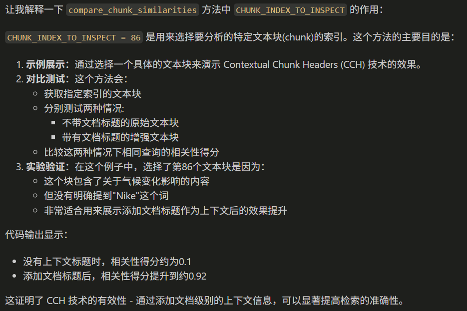
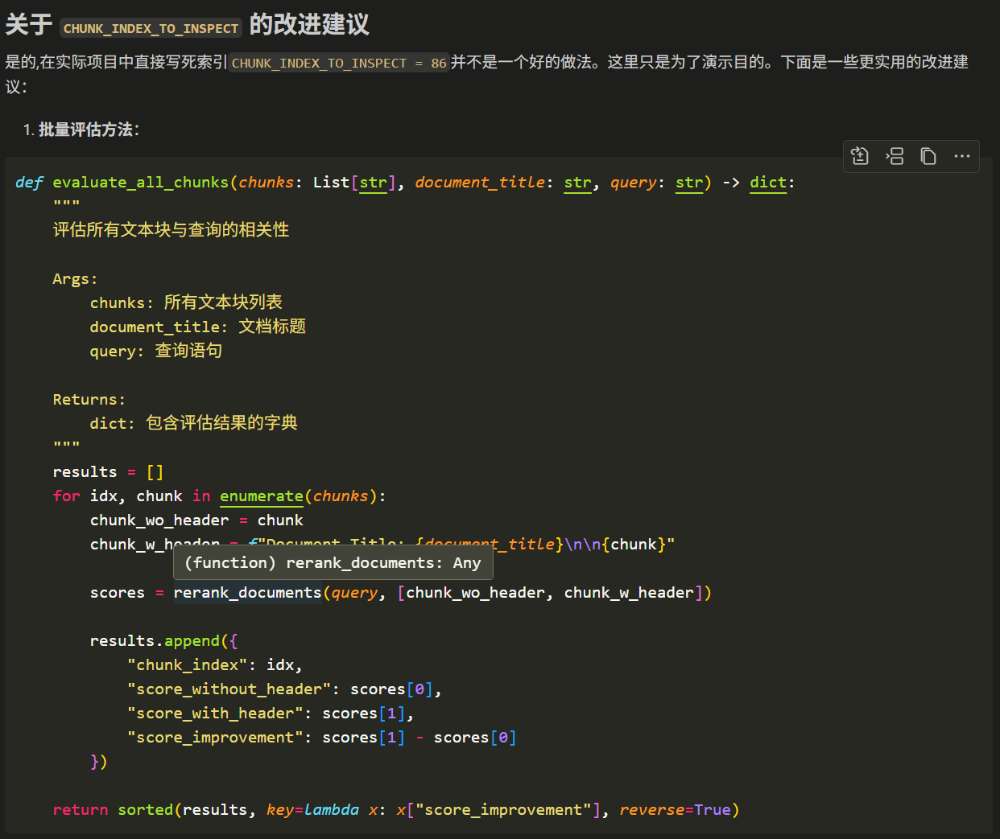
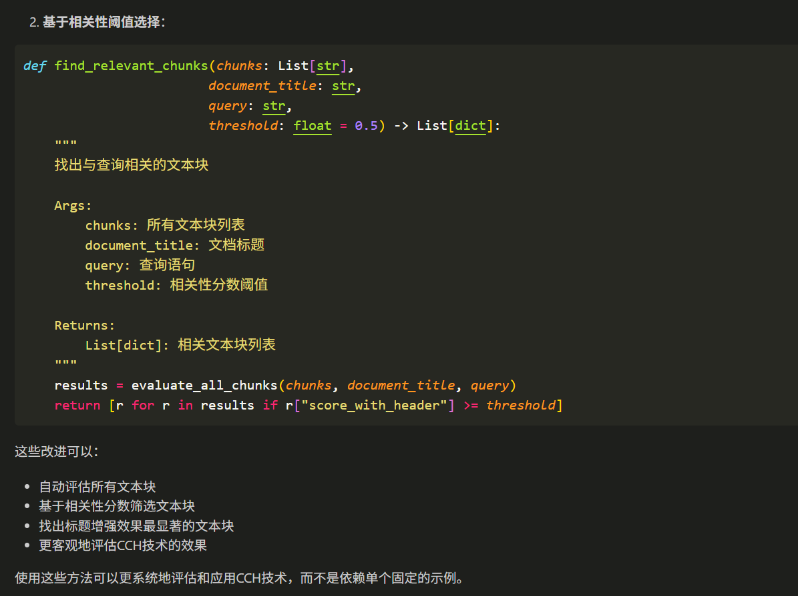

让我解释一下 compare_chunk_similarities 方法中 CHUNK_INDEX_TO_INSPECT 的作用：

CHUNK_INDEX_TO_INSPECT = 86 是用来选择要分析的特定文本块(chunk)的索引。这个方法的主要目的是：

示例展示：通过选择一个具体的文本块来演示 Contextual Chunk Headers (CCH) 技术的效果。

对比测试：这个方法会：

获取指定索引的文本块
分别测试两种情况:
不带文档标题的原始文本块
带有文档标题的增强文本块
比较这两种情况下相同查询的相关性得分
实验验证：在这个例子中，选择了第86个文本块是因为：

这个块包含了关于气候变化影响的内容
但没有明确提到"Nike"这个词
非常适合用来展示添加文档标题作为上下文后的效果提升
代码输出显示：

没有上下文标题时，相关性得分约为0.1
添加文档标题后，相关性得分提升到约0.92
这证明了 CCH 技术的有效性 - 通过添加文档级别的上下文信息，可以显著提高检索的准确性。

在实际项目中不能通过写死索引这么对比吧

关于 CHUNK_INDEX_TO_INSPECT 的改进建议

是的,在实际项目中直接写死索引CHUNK_INDEX_TO_INSPECT = 86并不是一个好的做法。这里只是为了演示目的。下面是一些更实用的改进建议：

批量评估方法：
基于相关性阈值选择：
这些改进可以：

自动评估所有文本块
基于相关性分数筛选文本块
找出标题增强效果最显著的文本块
更客观地评估CCH技术的效果
使用这些方法可以更系统地评估和应用CCH技术，而不是依赖单个固定的示例。

