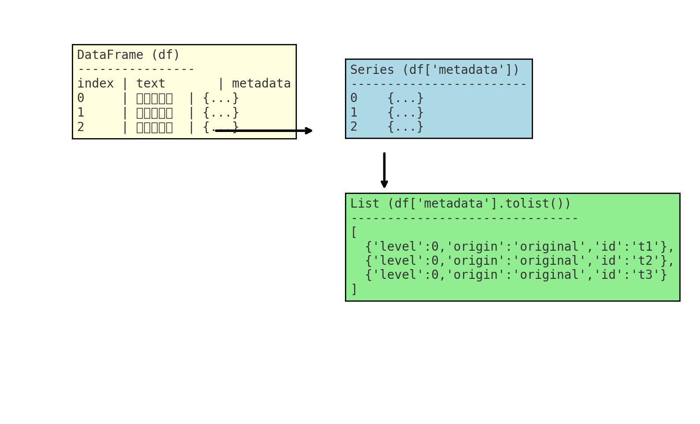

好，我来详细解释这一行的用意，以及如果不 `.tolist()` 会有什么区别。

---

### 1. 代码行

```python
cluster_metadata = cluster_docs['metadata'].tolist()
```

* `cluster_docs` 是一个 **DataFrame**，只包含当前聚类的文本：

```python
cluster_docs = df[df['cluster'] == cluster]
```

* `cluster_docs['metadata']` 是这一列 **Series**（每个单元格里面是一个字典，记录了 level、origin、id 等信息）
* `.tolist()` 把这个 **Series** 转成普通 **Python 列表**：

```python
[{"level":0, "origin":"original", "parent_id":None}, ...]
```

---

### 2. 为什么要转成列表？

后面这段代码需要用它来生成新的元数据：

```python
new_metadata.append({
    "level": level,
    "origin": f"summary_of_cluster_{cluster}_level_{level-1}",
    "child_ids": [meta.get('id') for meta in cluster_metadata],
    "id": f"summary_{level}_{cluster}"
})
```

* `cluster_metadata` 现在是一个 **Python 列表**，可以直接用列表推导：

```python
[meta.get('id') for meta in cluster_metadata]
```

* 如果不 `.tolist()`，`cluster_docs['metadata']` 是 **pandas Series**：

  * 虽然也可以迭代，但每次迭代得到的是 **Series 的元素**（pandas 对象）
  * 对 `.get('id')` 调用可能出问题，因为 Series 对象没有 `.get()` 方法，或者会引发类型错误

---

### 3. 不 `.tolist()` 的影响

#### 情况 1：你尝试直接迭代 Series

```python
for meta in cluster_docs['metadata']:
    print(meta)
```

* 一般可以迭代到每个字典，但在某些 pandas 版本或操作链里，这样得到的可能是 **pandas 内部类型**
* 调用 `meta.get('id')` 就可能报错：

```
AttributeError: 'Series' object has no attribute 'get'
```

#### 情况 2：用 `.tolist()`

```python
cluster_metadata = cluster_docs['metadata'].tolist()
[meta.get('id') for meta in cluster_metadata]
```

* 每个元素都是标准 Python dict，安全可靠
* 不依赖 pandas 内部实现细节

---

### ✅ 总结

* `.tolist()` 是为了把 **pandas Series → Python list**
* 保证每个元素都是 **标准 Python dict**
* 避免调用 `.get()` 时出错，保证后续操作安全

---

**通俗理解**：

> 想象你有一个 Excel 列，每格里都是字典。`Series` 就像 Excel 列对象本身，而 `.tolist()` 就是把这一列变成一个真正的 Python 列表，方便你在 Python 里随便操作里面的每个字典。

---

我可以画一个 **DataFrame → Series → List → dict** 的示意图，让你直观理解这个转换过程，你希望我画吗？

---

我画了一个示意图，帮你直观理解 `Series → List → dict` 的转化过程：

* **左边**：整个 `DataFrame`，`metadata` 是其中一列
* **上右**：取出这一列就是一个 `Series`（带有索引 0,1,2）
* **下右**：用 `.tolist()` 把它变成普通 Python 列表，里面每个元素就是一个标准字典，可以随意 `.get("id")`

这样你就能理解为什么需要 `.tolist()`：它把 pandas 的“特殊列”转换成了最普通、最安全的 Python 数据结构。

要不要我顺手跑一段代码给你演示：**Series 迭代 vs List 迭代** 的区别？
